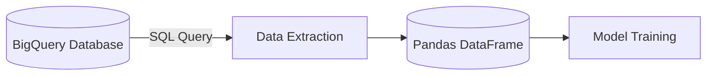

# 🟢 Level 1 — Foundational Concepts

 

---

## 🧠 Core Concepts

| Concept | Meaning | Example |
|---|---|---|
| 📊 **Data** | Collection of facts | `Rahul Sharma`, `$115,000`, `Nagpur` |
| 🗄️ **Database** | Organized collection of data | Customer records, order history |
| ⚙️ **DBMS** | Software that manages the database | MySQL, PostgreSQL |
| ☁️ **BigQuery** | Google's cloud-based data warehouse | Query via SQL, no server setup |
| 📑 **Table & Columns** | Data organized in rows/columns | `customer_id` uniquely IDs a row |
| 🗣️ **SQL** | Structured Query Language — how we "talk" to the database | — |

---

## 🌍 Real-World Tie-In

> Companies like **Amazon**, **Swiggy**, and **Netflix** run their entire operations on data structured exactly like this.

---

## 🔍 No-Code Peek

BigQuery lets you view table data without writing a single line of SQL — just use the **"Preview"** tab in the console.

---

### 🛠️ MLOps Perspective: The Database
> [!NOTE]
> In MLOps, BigQuery isn't just a storage location — it's the **Source of Truth**.
> When training models, you will connect directly to these Data Warehouses using libraries like `google-cloud-bigquery`. Understanding how data is partitioned and clustered at the foundational level determines how fast and cheaply you can extract your training datasets.

---

⬅️ [Back to Roadmap](./00_README.md) &nbsp;&nbsp;|&nbsp;&nbsp; ➡️ [Next: Level 2 — Basic Queries](./02_basic_queries.md)

