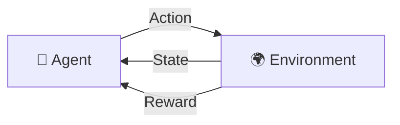

# 🤖 Reinforcement Learning

> [!NOTE]
> **Definition:** Reinforcement learning (RL) is a core branch of machine learning where an autonomous **agent** learns to make decisions by performing **actions** in an **environment** to maximize cumulative **rewards**.

## ⚙️ How Reinforcement Learning Works

Unlike supervised learning, which relies on pre-labeled datasets, reinforcement learning works through **trial and error**. The system operates in a continuous feedback loop:

- 🏎️ **Agent:** The decision-making program or AI model.
- 🌍 **Environment:** The world or system the agent interacts with.
- 📍 **State:** The current situation or condition of the agent.
- 🕹️ **Action:** The moves or decisions the agent can take.
- 🏆 **Reward:** Positive or negative feedback (penalty) given by the environment based on the action.

> The agent chooses an action based on its **policy** (its decision-making rule), observes the new state of the environment, receives a reward, and updates its strategy to favor actions that yield higher long-term rewards. It must constantly balance **exploration** (trying new moves) with **exploitation** (using known good moves).

## 🧩 Main Components and Approaches

Reinforcement learning models fall into different categories based on how they process information:

- **Model-Based vs. Model-Free:** Model-based approaches use a pre-designed map or understanding of how the environment works, while model-free approaches (like Q-learning) learn directly from trial outcomes without an explicit environmental model.
- **Online vs. Offline:** Online learning updates in real-time as the agent explores, whereas offline learning trains on static, pre-recorded historical logs or datasets.

---
### 🛠️ MLOps Perspective: Reinforcement Learning

> [!IMPORTANT]
> As an aspiring MLOps Engineer, keep these things in mind for Reinforcement Learning pipelines:
> 
> - **Simulation Infrastructure:** RL requires a highly scalable environment for the agent to train in. MLOps for RL often focuses on managing distributed compute (e.g., Ray, Kubernetes) to run millions of simulated environments in parallel.
> - **Continuous Training loop:** RL agents in production (like recommender systems) might be trained completely online. This requires a robust infrastructure to collect state-action-reward triplets in real-time, update the model, and deploy it without downtime.
> - **Safety and Rollbacks:** Since RL agents learn by trial and error, they can exhibit unpredictable behavior in production. Strict safety bounds, reward clipping, and instant fallback models are critical MLOps requirements.