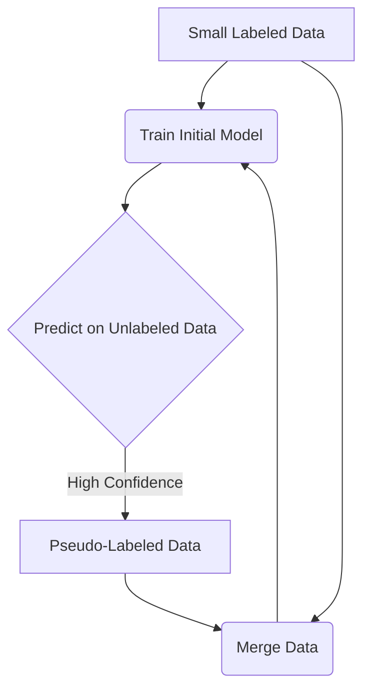

# 🌗 Semi-Supervised Learning

> [!NOTE]
> **Definition:** Semi-supervised learning is a machine learning approach that uses a **small amount of labeled data** and a **large amount of unlabeled data** to train models. It cuts down high data-labeling costs while improving prediction accuracy over using labeled data alone.

## 🔄 How It Works

1. **Initial Training:** The algorithm trains first on the small group of labeled data.
2. **Pseudo-Labeling:** The trained model predicts labels for the unlabeled data.
3. **Iteration:** High-confidence predictions (often called pseudo-labels) are merged with the labeled data to retrain and refine the model.

## 🛠️ Core Techniques

- **Self-Training:** A single model teaches itself by adding its most confident predictions back into the training pool.
- **Co-Training:** Two separate models use different feature views to label data and teach one another.
- **Graph-Based Models:** Data points form a network where known labels spread across connected nodes based on similarity.

---
### 🛠️ MLOps Perspective: Semi-Supervised Learning

> [!IMPORTANT]
> As an aspiring MLOps Engineer, keep these things in mind for Semi-Supervised Learning pipelines:
> 
> - **Active Learning Pipelines:** Semi-supervised learning often overlaps with active learning. Build MLOps pipelines where low-confidence predictions from your model are automatically routed to human annotators (via tools like Label Studio) to create new labeled data.
> - **Data Quality Checks:** Pseudo-labels can introduce confirmation bias, where the model confidently predicts the wrong thing and reinforces its own mistakes. Implement strict data quality tests and monitor confidence distributions.
> - **Compute Efficiency:** Retraining models constantly as new pseudo-labels are generated is computationally expensive. You will need to orchestrate pipelines (e.g., using Kubeflow or Airflow) to decide *when* it's worth triggering a full retraining cycle based on the volume of new high-confidence labels.